# n8n Azure Container solution Quick starter

A modern, serverless deployment solution for [n8n (Community Edition)](https://n8n.io) on Azure Container Apps with PostgreSQL Flexible Server, featuring automated (Azure Devops) CI/CD pipelines and environment-specific configurations.

## 🚀 Features

- **Serverless Architecture**: Deploy n8n on Azure Container Apps for cost-effective, auto-scaling workloads
- **Multi-Environment Support**: Separate configurations for Development, Acceptance, and Production
- **Automated CI/CD**: Azure DevOps pipeline with build, validate, dry-run, and deploy stages
- **Infrastructure as Code**: Bicep templates for reproducible deployments
- **High Availability**: Production-ready with multiple replicas and auto-scaling
- **Cost Optimized**: Pay-per-use pricing with automatic scaling to zero for development
- **Simple Setup**: No complex variable groups required - everything in config files
- **Secure Passwords**: Dynamically generated random passwords for each deployment

## 🏗️ Architecture

```mermaid
graph TB
    %% Pipeline Flow
    subgraph "🚀 CI/CD Pipeline"
        A[📝 Code Push] --> B[🔄 Auto Deploy to Dev]
        B --> C{✅ Success?}
        C -->|Yes| D[👥 Approval: Acc]
        C -->|No| E[💥 Failed]
        D --> F[👥 Approval: Prd]
        F --> G[🎉 Deployed]
    end

    %% Azure Resources
    subgraph "☁️ Azure Infrastructure"
        H[🚀 n8n Container App] 
        I[🐘 PostgreSQL Database]
        J[🔐 Key Vault Secrets]
        K[📊 Log Analytics]
    end

    %% Connections
    B -.->|Deploys| H
    D -.->|Deploys| H
    F -.->|Deploys| H
    H -.->|Connects| I
    H -.->|Accesses| J
    H -.->|Logs to| K

    %% Styling
    classDef pipeline fill:#e3f2fd,stroke:#1976d2,color:#1976d2,stroke-width:3px
    classDef success fill:#d4edda,stroke:#155724,color:#155724,stroke-width:3px
    classDef failure fill:#f8d7da,stroke:#721c24,color:#721c24,stroke-width:3px
    classDef approval fill:#fff3cd,stroke:#856404,color:#856404,stroke-width:3px
    classDef azure fill:#f3e5f5,stroke:#7b1fa2,color:#7b1fa2,stroke-width:3px

    class A,B pipeline
    class G success
    class E failure
    class D,F approval
    class H,I,J,K azure
```



## 📊 Environment Configurations

### Development Environment

- **CPU**: 1.0 cores
- **Memory**: 2Gi
- **Min Replicas**: 1 (always available)
- **Max Replicas**: 1
- **Cost**: ~$40-50/month

### Acceptance Environment

- **CPU**: 1.0 cores
- **Memory**: 2Gi
- **Min Replicas**: 1 (always available)
- **Max Replicas**: 1
- **Cost**: ~$40-50/month

### Production Environment

- **CPU**: 1.0 cores
- **Memory**: 2Gi
- **Min Replicas**: 1 (high availability)
- **Max Replicas**: 1
- **Cost**: ~$40-50/month

## 💰 Cost Breakdown

| Resource                    | Development      | Acceptance       | Production       |
|-----------------------------|------------------|------------------|------------------|
| Container Apps              | $25-35/month     | $25-35/month     | $25-35/month     |
| PostgreSQL Flexible Server  | $15/month        | $15/month        | $15/month        |
| Log Analytics               | $5/month         | $5/month         | $5/month         |
| **Total**                   | **$45-55/month** | **$45-55/month** | **$45-55/month** |

**Cost Savings**: Compared to VM-based deployment (~$100-150/month), Container Apps can save 60-70% for all environments.

## 🛠️ Prerequisites

1. **Azure Subscription** with Contributor access
2. **Azure DevOps Organization** and Project
3. **Azure CLI** installed locally (for initial setup)

## 🚀 Quick Start

### 1. Clone

```bash
git clone https://github.com/srmds/n8n-azure-apps-quick-starter.git
cd n8n-azure-container-apps-starter
```

### 2. Update Configuration Files

Edit the environment config files in `.azuredevops/config/`:

#### Development ([`config-infra-dev.yml`](.azuredevspo/config/config-infra-dev.yml))

```yaml
# Update these values
  resourceGroupName: 'n8n-rg-dev'
```

#### Acceptance ([`config-infra-acc.yml`](.azuredevspo/config/config-infra-acc.yml))

```yaml
# Update these values
  resourceGroupName: 'n8n-rg-acc'
```

#### Production ([`config-infra-prd.yml`](.azuredevspo/config/config-infra-prd.yml))

```yaml
# Update these values
  resourceGroupName: 'n8n-rg-prd'
```

**Note**: PostgreSQL passwords are automatically generated during deployment for security.

### 3. Create Azure DevOps Environments

- Create environments in Azure DevOps for approval gates:

1. Go to **Pipelines** → **Environments**
2. Create environment: `acc` (with approval required)
3. Create environment: `prd` (with approval required)

- Open [azure-pipelines.yml](.azuredevops/azure-pipelines.yml) find the TODO's for the service connection name, replace with _your_ service connections

```yaml
 azureSubscription: 'YOUR_SERVICE_CONNECTION' 
```

### 4. Run the Pipeline

1. Push your changes to trigger the pipeline
2. The pipeline will automatically deploy to dev
3. Approval required for acc and prd stages
4. Monitor the deployment progress

## 🔧 Configuration

### Environment-Specific Settings

Each environment has its own configuration file in `.azuredevops/config/`:

```yaml
# Development - Cost optimized
containerCpu: '1.0'
containerMemory: '2Gi'
maxReplicas: '1'
minReplicas: '0'  # Scales to zero

# Acceptance - Balanced performance
containerCpu: '1.0'
containerMemory: '2Gi'
maxReplicas: '1'
minReplicas: '1'  # Always available

# Production - High performance
containerCpu: '2.0'
containerMemory: '2Gi'
maxReplicas: '2'
minReplicas: '1'  # High availability
```

### n8n Configuration

The deployment includes optimized n8n environment variables:

- **Database**: PostgreSQL with SSL enabled
- **Security**: Basic authentication enabled
- **Performance**: Optimized for Container Apps
- **Monitoring**: Log Analytics integration
- **Scaling**: HTTP and CPU-based auto-scaling

## 🔄 Pipeline Stages

1. **Generate Password**: Creates secure random password for PostgreSQL
2. **Build**: Compiles Bicep templates
3. **Validate**: Validates infrastructure configuration
4. **Dry-Run**: Shows what-if analysis
5. **Deploy**: Provisions Azure resources
6. **Test**: Verifies deployment health

## 🔐 Security Features

### Dynamic Password Generation

- **Automatic**: Random 25-character passwords generated for each deployment
- **Secure**: Uses OpenSSL for cryptographically secure random generation
- **Unique**: Each environment gets its own password

### Azure Key Vault Integration

- **Secure Storage**: Generated passwords are automatically stored in Azure Key Vault
- **Auto-Creation**: Key Vault is created automatically if it doesn't exist
- **Environment-Specific**: Each environment has its own Key Vault
- **Secret Management**: Passwords stored as secrets with proper naming conventions

### Password Format

```text
Password stored in Key Vault: n8n-kv-dev
Secret name: postgres-password-n8n-env-dev
Secret name: n8n-env-dev-encryption-key
```

### Key Vault Configuration

Each environment can optionally use Key Vault for password storage:

```yaml
# Development
keyVaultName: 'n8n-kv-dev' 

# Acceptance  
keyVaultName: 'n8n-kv-acc' 

# Production
keyVaultName: 'n8n-kv-prd'
```

**Benefits of Key Vault Integration:**

- **Centralized Secrets**: All passwords stored in one secure location
- **Access Control**: Fine-grained permissions for secret access
- **Audit Trail**: Complete logging of secret access and modifications
- **Compliance**: Meets enterprise security requirements
- **Integration**: Easy integration with other Azure services

## 📈 Scaling Behavior

### Development

- Scales to zero when not in use
- Scales up to 1 replica under load
- Perfect for development and testing

### Acceptance

- Always maintains 1 replica for availability
- Scales up to 1 replica under load
- Suitable for staging and testing

### Production

- Always maintains 1 replica for high availability
- Scales up to 1 replica under load
- Handles production workloads efficiently

## 🔍 Monitoring and Logging

- **Azure Monitor**: Built-in monitoring for Container Apps
- **Log Analytics**: Centralized logging and querying
- **Application Insights**: Optional for detailed application monitoring
- **Health Checks**: Automated deployment verification

## 🛡️ Security Features

- **SSL/TLS**: Automatic certificate management
- **Basic Authentication**: Built-in n8n authentication
- **Network Security**: Private networking options available
- **Dynamic Passwords**: Automatically generated secure passwords

## 🔧 Customization

### Adding Custom Environment Variables

Edit the Bicep template (`infrastructure/main.bicep`) to add custom n8n environment variables:

```bicep
{
  name: 'CUSTOM_VARIABLE'
  value: 'custom-value'
}
```

### Modifying Scaling Rules

Update the scaling configuration in the Bicep template:

```bicep
scale: {
  minReplicas: 1
  maxReplicas: 10
  rules: [
    {
      name: 'http-scaling'
      http: {
        metadata: {
          concurrentRequests: '20'  // Adjust based on needs
        }
      }
    }
  ]
}
```

## 🚨 Troubleshooting

### Common Issues

1. **Deployment Fails**: Check Azure subscription permissions
2. **High Costs**: Review scaling settings and resource allocation
3. **Performance Issues**: Monitor CPU/memory usage and adjust accordingly

### Debug Commands

```bash
# Check Container App status
az containerapp show --name n8n-app-dev --resource-group n8n-rg-dev

# View logs
az containerapp logs show --name n8n-app-dev --resource-group n8n-rg-dev

# Check scaling
az containerapp revision list --name n8n-app-dev --resource-group n8n-rg-dev
```

## 📚 Additional Resources

- [n8n Documentation](https://docs.n8n.io/)
- [Azure Container Apps Documentation](https://docs.microsoft.com/en-us/azure/container-apps/)
- [Azure DevOps Documentation](https://docs.microsoft.com/en-us/azure/devops/)
- [Bicep Documentation](https://docs.microsoft.com/en-us/azure/azure-resource-manager/bicep/)

## 🤝 Contributing

1. Fork the repository
2. Create a feature branch
3. Make your changes
4. Test thoroughly
5. Submit a pull request

## 📄 License

This project is licensed under the MIT License - see the [LICENSE](LICENSE) file for details.

---

**Note**: This deployment is optimized for cost-effectiveness and scalability. Adjust resource allocations based on your specific workload requirements. Passwords are automatically generated for security - no manual password management required!
