# n8n Azure Container Apps CI/CD Pipeline

This document provides a detailed overview of the CI/CD pipeline architecture for deploying n8n on Azure Container Apps.

## Pipeline Overview

The pipeline follows a multi-environment deployment strategy with automated infrastructure provisioning, security management, and testing. It uses Azure DevOps with Bicep templates for Infrastructure as Code.

## Mermaid Diagram

```mermaid
graph TB
    %% Pipeline Triggers
    subgraph "Pipeline Triggers"
        A[Code Push] --> B[Pipeline Trigger]
        B --> C{Branch Check}
        C -->|main/master/feature/*| D[Pipeline Starts]
        C -->|other branches| E[No Action]
    end

    %% Development Stage
    subgraph "Development Stage (Auto Deploy)"
        D --> F[PreConfigDev Job]
        F --> G[Generate Random Passwords]
        G --> H[DeployToDev Job]
        H --> I[Build & Validate Bicep]
        I --> J[Dry Run Analysis]
        J --> K[Deploy Infrastructure]
        K --> L[PostConfigDev Job]
        L --> M[TestDev Job]
        M --> N[Health Check Test]
    end

    %% Acceptance Stage
    subgraph "Acceptance Stage (Approval Required)"
        N --> O{Dev Success?}
        O -->|Yes| P[Approval Gate: ACC]
        P --> Q[DeployToAcc Job]
        Q --> R[Build & Validate Bicep]
        R --> S[Dry Run Analysis]
        S --> T[Deploy Infrastructure]
        T --> U[PostConfigAcc Job]
        U --> V[TestAcc Job]
        V --> W[Health Check Test]
    end

    %% Production Stage
    subgraph "Production Stage (Approval Required)"
        W --> X{Acc Success?}
        X -->|Yes| Y[Approval Gate: PRD]
        Y --> Z[PreConfigPrd Job]
        Z --> AA[Generate Random Passwords]
        AA --> BB[DeployToPrd Job]
        BB --> CC[Build & Validate Bicep]
        CC --> DD[Dry Run Analysis]
        DD --> EE[Deploy Infrastructure]
        EE --> FF[PostConfigPrd Job]
        FF --> GG[TestPrd Job]
        GG --> HH[Health Check Test]
    end

    %% Success/Failure Paths
    HH --> II[Pipeline Complete]
    O -->|No| JJ[Pipeline Failed]
    X -->|No| JJ
    P -->|Rejected| JJ
    Y -->|Rejected| JJ

    %% Styling
    classDef success fill:#d4edda,stroke:#155724,color:#155724
    classDef failure fill:#f8d7da,stroke:#721c24,color:#721c24
    classDef approval fill:#fff3cd,stroke:#856404,color:#856404
    classDef process fill:#d1ecf1,stroke:#0c5460,color:#0c5460
    classDef security fill:#e2e3e5,stroke:#383d41,color:#383d41

    class II success
    class JJ failure
    class P,Y approval
    class H,Q,BB process
    class G,AA security
```

## Detailed Stage Breakdown

### 1. Development Stage

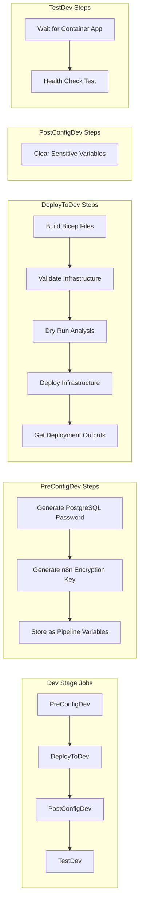

### 2. Acceptance Stage

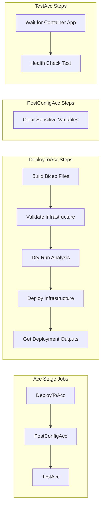

### 3. Production Stage

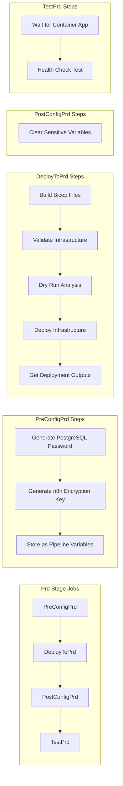

## Security Flow

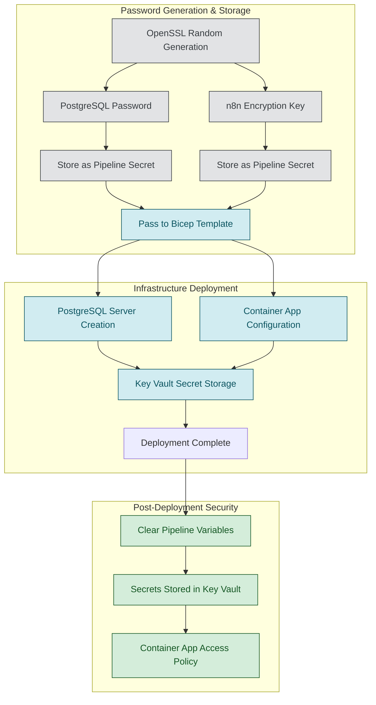

## Infrastructure Deployment Flow

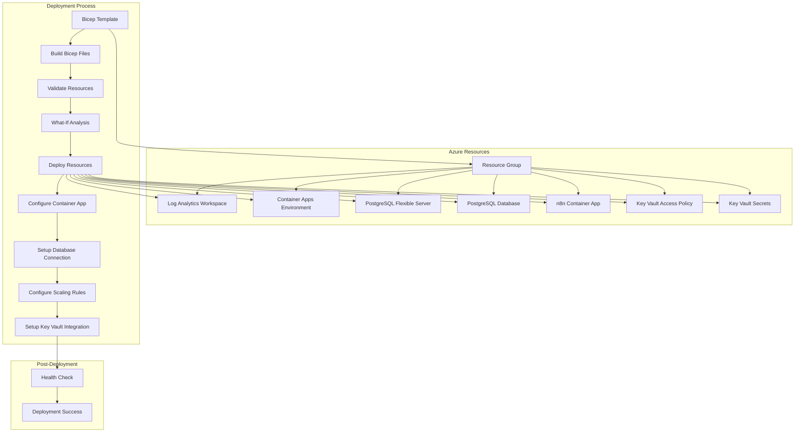

## Environment Configuration

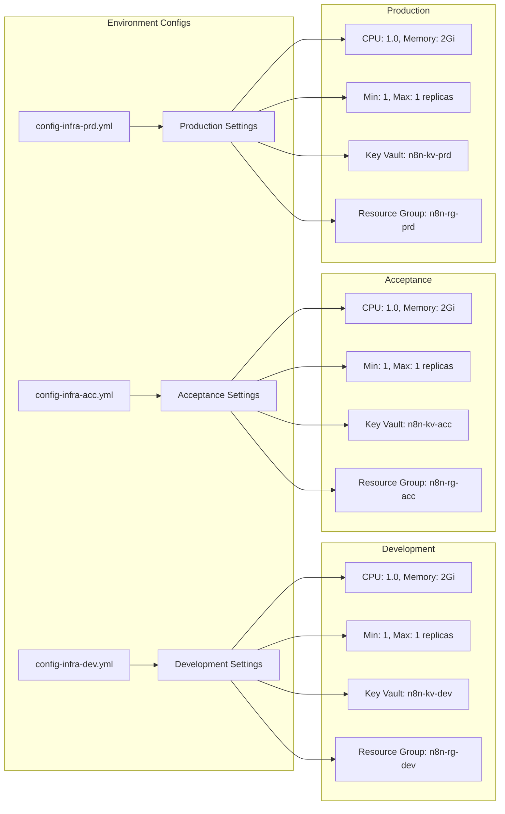

## Pipeline Templates

```mermaid
graph TB
    subgraph "Pipeline Templates"
        A[provision-infra.yml] --> A1[Infrastructure Deployment]
        B[run-health-check.yml] --> B1[Health Verification]
    end

    subgraph "Template Parameters"
        A1 --> A2[Azure Subscription]
        A1 --> A3[Resource Group]
        A1 --> A4[Environment Config]
        A1 --> A5[Key Vault Name]
        A1 --> A6[Container Settings]
        A1 --> A7[PostgreSQL Settings]
        
        B1 --> B2[Container App Name]
        B1 --> B3[Resource Group]
        B1 --> B4[Wait Time]
    end

    subgraph "Template Functions"
        A1 --> A8[Build Bicep Files]
        A1 --> A9[Validate Infrastructure]
        A1 --> A10[Dry Run Analysis]
        A1 --> A11[Deploy Resources]
        A1 --> A12[Get Outputs]
        
        B1 --> B5[Wait for Container App]
        B1 --> B6[Test HTTP Response]
        B1 --> B7[Verify Health Status]
    end
```

## Infrastructure Components (main.bicep)

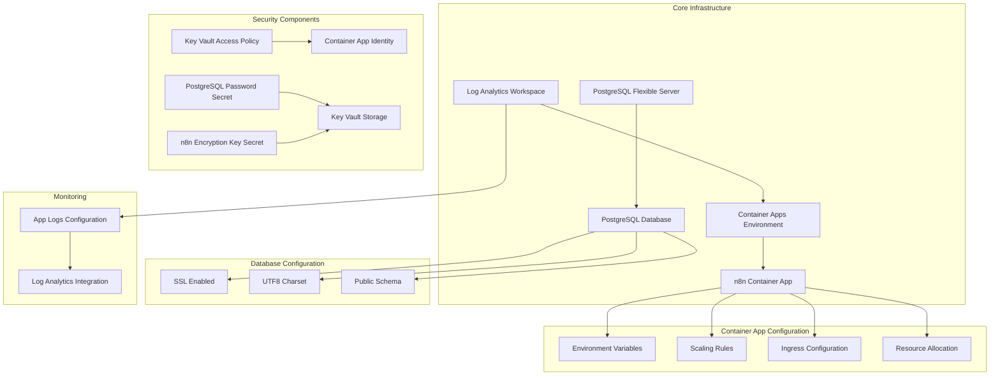

## Success Criteria

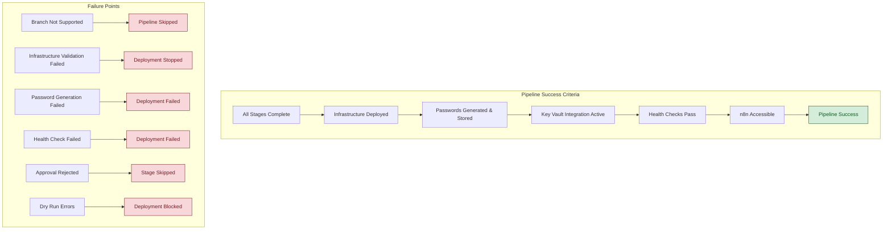

## Cost Optimization

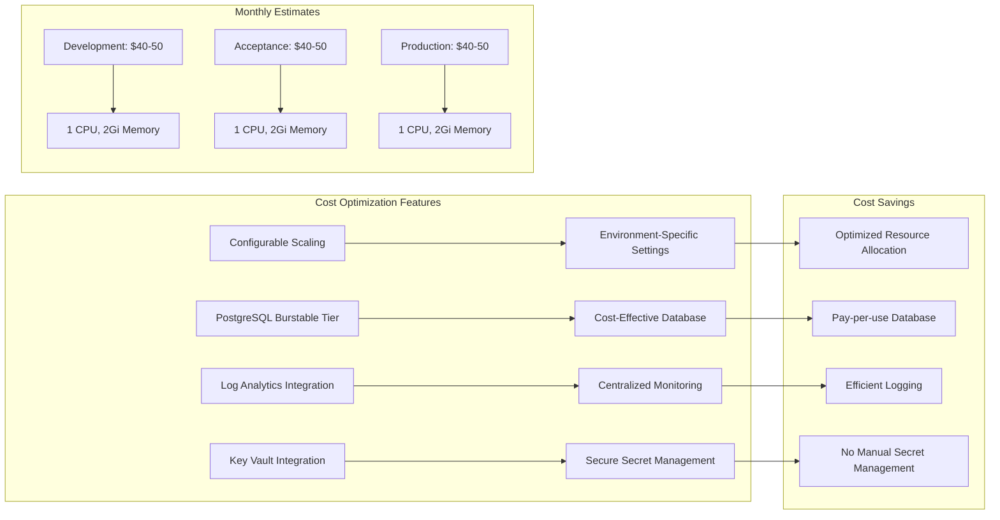

## Security Architecture

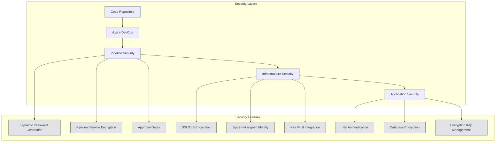

## Key Features

### Infrastructure as Code
- **Bicep Templates**: Complete infrastructure definition in `infrastructure/main.bicep`
- **Modular Design**: Separate Key Vault modules for access policies and secrets
- **Environment-Specific Configs**: Dedicated configuration files for dev, acc, and prd

### Security
- **Dynamic Password Generation**: OpenSSL-based random password generation
- **Key Vault Integration**: Secure storage of PostgreSQL passwords and n8n encryption keys
- **System-Assigned Identity**: Container App identity for Key Vault access
- **Pipeline Variable Encryption**: Sensitive data encrypted in pipeline variables

### Deployment Strategy
- **Multi-Environment**: Separate stages for dev, acceptance, and production
- **Approval Gates**: Manual approval required for acc and prd environments
- **Dry Run Support**: What-if analysis before actual deployment
- **Health Checks**: Automated testing of deployed applications

### Monitoring & Logging
- **Log Analytics Integration**: Centralized logging and monitoring
- **Health Check Templates**: Automated verification of deployment success
- **Deployment Outputs**: Capture and display of deployment results

---

## Pipeline Summary

This CI/CD pipeline provides:

- **Multi-environment deployment** with approval gates for production stages
- **Infrastructure as Code** using Bicep templates with modular design
- **Dynamic password generation** with Azure Key Vault integration
- **Automated testing** and health checks
- **Cost optimization** with configurable resource allocation
- **Security best practices** with encrypted secrets and system-assigned identities

The pipeline ensures reliable, secure, and cost-effective deployment of n8n across development, acceptance, and production environments using Azure Container Apps and PostgreSQL Flexible Server.
