# n8n Azure Container Apps CI/CD Pipeline

This document provides a detailed overview of the CI/CD pipeline architecture for deploying n8n on Azure Container Apps.

## Pipeline Overview

The pipeline follows a multi-environment deployment strategy with automated infrastructure provisioning, security management, and testing.

## Mermaid Diagram

```mermaid
graph TB
    %% Pipeline Triggers
    subgraph "Pipeline Triggers"
        A[Code Push] --> B[Pipeline Trigger]
        B --> C{Branch Check}
        C -->|main/master/feature/*| D[Pipeline Starts]
        C -->|other branches| E[No Action]
    end

    %% Development Stage
    subgraph "Development Stage (Auto Deploy)"
        D --> F[Deploy to Dev]
        F --> G[Generate Random Password]
        G --> H[Store in Key Vault]
        H --> I[Build Bicep Files]
        I --> J[Validate Infrastructure]
        J --> K[Dry Run Analysis]
        K --> L[Deploy Infrastructure]
        L --> M[Configure DNS & SSL]
        M --> N[Health Check Test]
    end

    %% Acceptance Stage
    subgraph "Acceptance Stage (Approval Required)"
        N --> O{Dev Success?}
        O -->|Yes| P[Approval Gate: ACC]
        P --> Q[Deploy to Acceptance]
        Q --> R[Generate Random Password]
        R --> S[Store in Key Vault]
        S --> T[Build Bicep Files]
        T --> U[Validate Infrastructure]
        U --> V[Dry Run Analysis]
        V --> W[Deploy Infrastructure]
        W --> X[Configure DNS & SSL]
        X --> Y[Health Check Test]
    end

    %% Production Stage
    subgraph "Production Stage (Approval Required)"
        Y --> Z{Acc Success?}
        Z -->|Yes| AA[Approval Gate: PRD]
        AA --> BB[Deploy to Production]
        BB --> CC[Generate Random Password]
        CC --> DD[Store in Key Vault]
        DD --> EE[Build Bicep Files]
        EE --> FF[Validate Infrastructure]
        FF --> GG[Dry Run Analysis]
        GG --> HH[Deploy Infrastructure]
        HH --> II[Configure DNS & SSL]
        II --> JJ[Health Check Test]
    end

    %% Success/Failure Paths
    JJ --> KK[Pipeline Complete]
    O -->|No| LL[Pipeline Failed]
    Z -->|No| LL
    P -->|Rejected| LL
    AA -->|Rejected| LL

    %% Styling
    classDef success fill:#d4edda,stroke:#155724,color:#155724
    classDef failure fill:#f8d7da,stroke:#721c24,color:#721c24
    classDef approval fill:#fff3cd,stroke:#856404,color:#856404
    classDef process fill:#d1ecf1,stroke:#0c5460,color:#0c5460
    classDef security fill:#e2e3e5,stroke:#383d41,color:#383d41

    class KK success
    class LL failure
    class P,AA approval
    class F,Q,BB process
    class G,R,CC,H,S,DD security
```

## Detailed Stage Breakdown

### 1. Development Stage

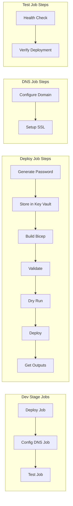

### 2. Acceptance Stage

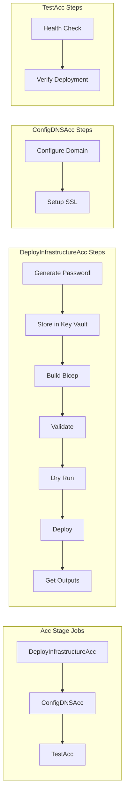

### 3. Production Stage

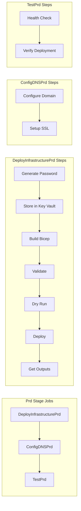

## Security Flow

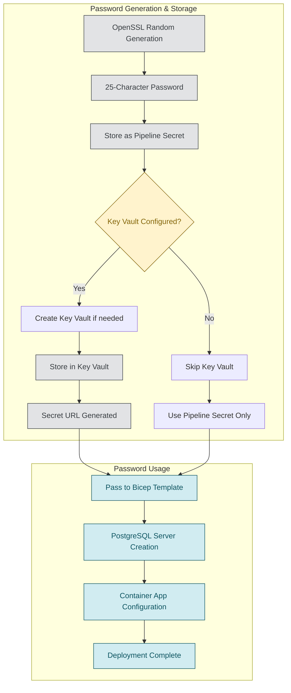

## Infrastructure Deployment Flow

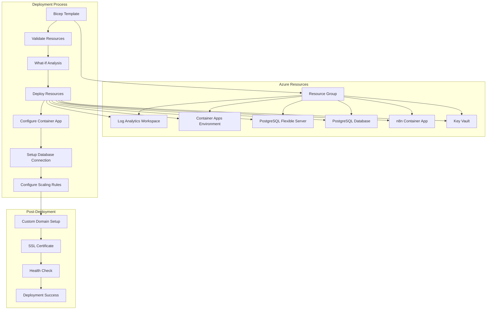

## Environment Configuration

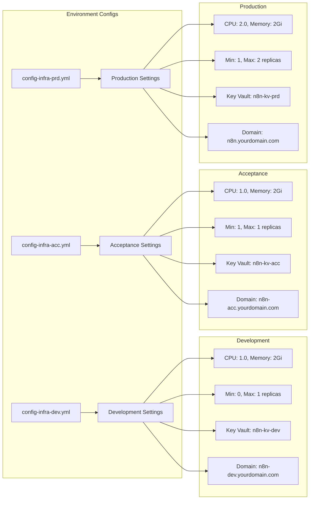

## Pipeline Templates

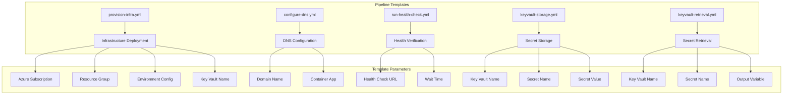

## Success Criteria

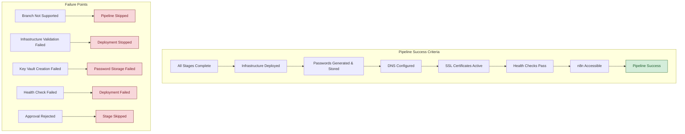

## Cost Optimization

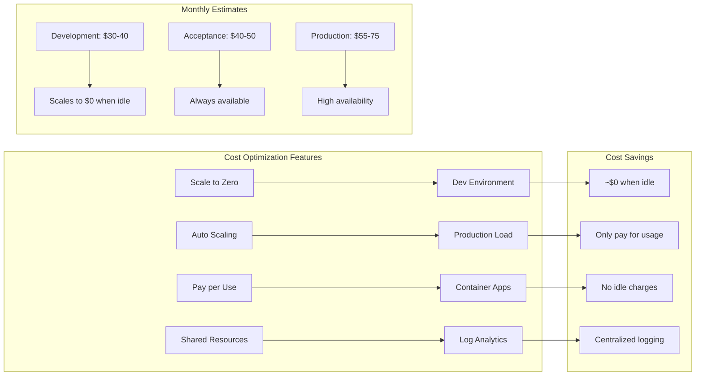

## Security Architecture

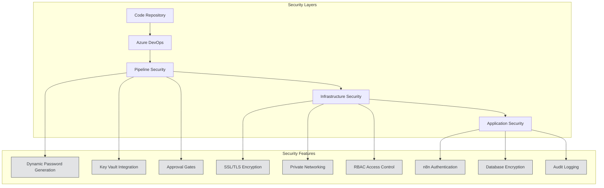

---

## Pipeline Summary

This CI/CD pipeline provides:

- **Multi-environment deployment** with approval gates for production stages
- **Infrastructure as Code** using Bicep templates
- **Dynamic password generation** with Azure Key Vault integration
- **Automated testing** and health checks
- **Cost optimization** with scale-to-zero capabilities
- **Security best practices** with encrypted secrets and SSL/TLS

The pipeline ensures reliable, secure, and cost-effective deployment of n8n across development, acceptance, and production environments.
